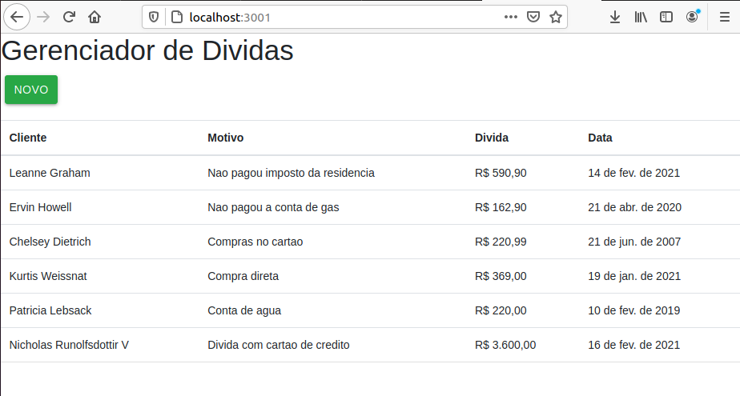

# Projeto CRUD simples

# Dependencias e Instalacao

- [nodejs](https://nodejs.org/pt-br/)
    `sudo apt install nodejs`
- [loopback 3](https://loopback.io/doc/en/lb3/)
    `npm install -g loopback-cli`
- [yarn](https://yarnpkg.com/)
    `npm install --global yarn`
- [mongodb](https://www.mongodb.com/)
    `sudo apt install mongodb`
- [react](https://reactjs.org/)
    `npm install -g create-react-app`

# First run

Na pasta raiz, eh so rodar o seguinte comando:

`yarn fresh-start`

para instalar os pacotes tanto pro node quanto pro react.

E apos isso eh so rodar o comando:

`yarn start`

que o loopback3 vai ser iniciado na porta 3000 e o react na porta 3001
